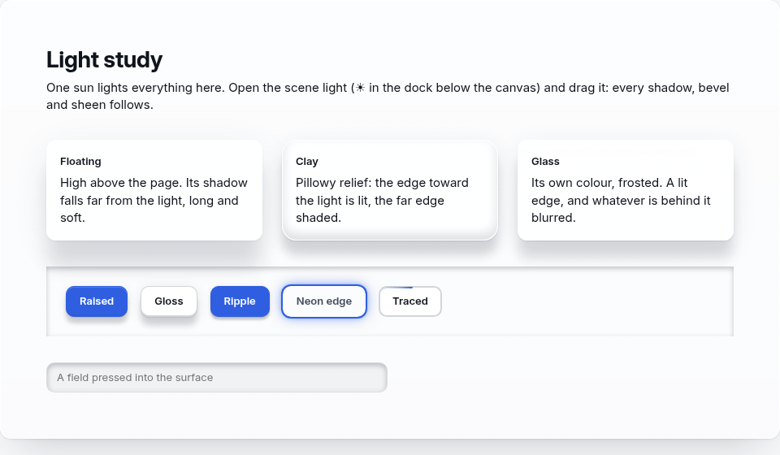

# Loom — Studio

*A loom is a tool for building: threads in, cloth out. This one takes
components in and gives you an interface.*

A desktop UI studio. You compose an interface from 117 components, and the
things you build actually work — in the editor, in the live preview, and in
what you export.

**And everything is lit by one sun.**



Give any component (or any part of one, like a grid's header or a card's
title) **height**, and its shadow falls away from the scene light: long and
soft from a low sun, tight from a high one. Bevels, wells and gloss are lit
from the same light. Drag the sun on the canvas and the whole design
re-lights, live. Then layer fills, strokes, glows, frosted glass, grain and a
light that runs around the edge; give each state (hover, pressed, selected…)
its own look, spring it into place, and decide what a click plays. It exports
as plain HTML and CSS.

Open the **Light study** starter and press ☀ in the dock to try it.

```bash
npm install
npm start          # build + launch the app
npm run verify     # ~1,130 checks in a real renderer
```

## The idea

Most UI builders let you lay out pixels and hand you a picture. Loom treats a
document as software: the control you drop **is** the control that ships, with
its behaviour, its validation and its accessibility already attached.

Three decisions shape everything else:

**Documents are rootless.** A new workspace contains nothing. There is no
sample project, no starter template, and nothing restores an old document
behind your back. The first node you drop becomes the root, and it is an
ordinary node — movable, resizable, editable, deletable. You are responsible
for the root because you chose it.

**Behaviour is built in, not authored.** There is no event system to configure
and no state to wire. A button presses, a tab switches and reveals its panels,
a disclosure opens, a table column sorts, a switch flips, a modal dismisses.
A control cannot be broken by forgetting a handler, because there is no handler
to forget.

**The preview is the artifact.** The live preview, the standalone HTML export
and the React export all run the *same* behaviour runtime, the *same* generated
layout rules and the *same* state stylesheet. If the preview disagreed with the
export, it would be worse than no preview at all.

## What is in the box

- **Looks, lit by one scene light.** Any component, or any of its named parts,
  takes a look: height (z), bevel, pressed-in wells, sheen, fills (solid and
  gradients, with blend modes), strokes (inside / centre / outside, dashed,
  gradient), glows, frosted backdrop, see-through surfaces, grain, per-corner
  radius and a travelling edge light. Shadows are *derived* from the light,
  never hand-drawn. Each state gets its own look, with real spring motion and
  click effects (ripple, sweep, pulse, sink). Ten built-in styles, your own
  saved styles, copy and paste a look, and the in-app assistant can do all of
  it too. See [`docs/shots/appearance`](docs/shots/appearance).

- **117 components** across containers, controls, data, text, navigation and
  feedback — with **3,017 properties**, every one of them verified to change the
  output. Every component carries the same spacing, surface and type styling;
  the Properties Panel opens on each component's essentials, with search and
  the rest one click away.
- **Built-in control behaviour** via one delegated runtime and one theme-driven
  stylesheet, shared by all three output targets.
- **Responsive layout** on container queries, so a design adapts to the box it
  is shown in — with a viewport switcher in the canvas, and per-breakpoint
  overrides you author from the same Inspector.
- **Composites** for the work that gets rebuilt constantly: `DataGrid`,
  `Field`, `KpiCard`, `AppShell`, `CommandPalette`, `SettingsSection` /
  `SettingsRow`. Where a composite replaced a tool, the old tool was **removed**
  rather than left beside it — see `ROADMAP.md` for the standing rules.
- **Exports**: standalone HTML (opens and works with no network) and a
  self-contained React component. Desktop-native output is the next step.
- **A lying detector.** `electron/prop-audit.ts` renders every component twice
  per declared property and diffs the markup, so a property that renders
  nothing fails the build. It is a ratchet, not a formality.

## Design rules the codebase enforces

1. **No duplicate function.** A new tool that supersedes an old one replaces it.
2. **Every tool is operational.** If its purpose implies interaction, it
   interacts.
3. **Every tool is responsive** where utility demands it.
4. **One state mechanism.** Native elements where the platform has one;
   everything else through the same attribute + CSS + runtime path.
5. **No hidden conventions.** A list-valued property declares its separator.
6. **No silent fallbacks.** Unknown components and malformed files fail loudly
   at the trust boundary, and the repair is reported rather than hidden.
7. **Output is the promise.** Preview and export are the same code.

## Architecture

| Area | Where |
|---|---|
| Model, ops, persistence | `src/model/` — `types`, `ops`, `persist`, `registry` |
| Component catalogue | `src/model/toolbox.ts`, `catalog1.ts`, `catalog2.ts` |
| Shared property vocabulary | `src/model/prop-vocab.ts` |
| Renderer (one source of output truth) | `src/render/web.tsx` |
| Behaviour runtime + state CSS | `src/render/behaviour.ts` |
| Responsive layout generation | `src/render/responsive.ts` |
| Icon set | `src/render/icons.ts` |
| Exporters | `src/export/html.ts`, `src/export/react.ts` |
| Editor shell | `src/app.tsx` |
| Verification | `electron/selftest.ts`, `electron/prop-audit.ts` |

`HANDOFF.md` is the running engineering log — what shipped, what was decided
and why, and what is deliberately still open. `ROADMAP.md` is the gap analysis
behind the build order.

## Verification

```bash
npm run typecheck      # strict, zero errors
npm run verify         # 602 checks in a real renderer
npm run probe:preview  # 11 live-preview steps
npm run probe:drag     # 8 real-input drag steps
```

The property audit runs inside `verify`, so a newly inert property fails the
build rather than shipping.

## Join in

Loom is built in the open. **Fork it, branch it, and tell us what you find.**
Start a thread in [Discussions](https://github.com/cse-creative-systems-engineering/loom-studio/discussions),
report a tool that falls short with the *This tool falls short* issue template,
or open a pull request; [CONTRIBUTING.md](CONTRIBUTING.md) has the steps and
the checks a change must pass.

## Licence

**Source-available, noncommercial, while in development.** Loom Studio is
licensed under the [PolyForm Noncommercial License 1.0.0](LICENSE): use it,
test it, study it, fork it and modify it for any noncommercial purpose.
Commercial use is not permitted under this license.

Versions published before 30 September 2026 were released under the MIT
License, and copies obtained under those terms keep them.

Includes an embedded `Atelier` component DSL, which is the author's earlier
design-system work and ships as a fixture for the importer.
